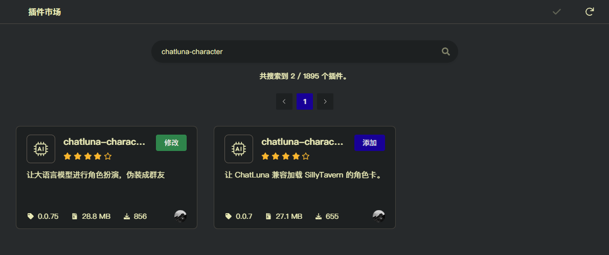

# 伪装群友 (Character) <Badge type="warning" text="实验性插件" />

此插件基于 Prompt 工程，尝试让大语言模型在群内伪装成群友对话。

此插件仍处于实验性阶段，「AI 味」可能还过浓。不要将其直接放入大群中。

## 配置

* 前往插件市场，安装 `chatluna-character` 插件。



## 使用

完成后启用插件。在 [应用群组](#applygroup) 中输入你需要应用的群组 ID，并在 [模型配置](#model) 中配置模型。

此时即可和尝试和伪装对话。如果正常回复了，则说明配置成功。

如果你需要新增或修改预设，默认预设的文件夹位于 `<koishi-data-path>/chathub/character/preset` 。

你可以前往表情包文件夹，修改伪装使用的表情包。表情包文件夹位于 `<koishi-data-path>/chathub/character/sticker` 。
表情包文件夹按照表情包的情绪类型分类。

## 预设

伪装的预设相比 ChatLuna 的预设，减少了很多自定义选项。下面是一个预设例子：

::: details default.yml
<<< ../../public/resources/character_preset.yml
:::

整个预设被分为 `status` ， `mute_keyword` ， `system` ， `name` , `nick_name` , `input` 。

让我们一步步来理解这些配置项。

### status

status 即为角色的状态，包括心情、状态、记忆、动作。
在预设的 `status` 中，只是初始的角色状态，具体状态的填充和生成，还需要 `input` 中进行。

### mute_keyword

mute_keyword 为禁用词。如果用户发送的消息中包含这些关键词并且配置了 [isForceMute](#isforcemute)，则会触发禁言。在群内不再响应，具体不响应时间由 [muteTime](#mutetime) 决定。

### name

name 指定为预设的名称。会在 [defaultPreset](#defaultpreset) 中显示。

### nick_name

nick_name 为角色的昵称，可以设置多个数组。开启 [isNickName](#isnickname) 后，当用户输入的开头匹配到 nick_name 中的任意一个时，将会触发伪装回复。

### system

system 是整个预设的核心部分。在默认预设中，基于类 yaml 的格式分成了几个板块：

* 个人信息:

  角色的个人信息，性别等。

* 性格爱好:

  角色的具体的性格，兴趣爱好等。

* 聊天行为:

  角色的聊天行为，包括回复风格，回复习惯等。

* 名词解释:

  角色的名词解释，包括一些网络梗，词汇解释等。起到类似口头禅的作用，让你的角色更贴近网友的回复。

* 人物状态:
  在这里介绍角色的状态，包括心情、状态、记忆、动作等。

* 回复格式:
  角色的回复格式，包括文本、表情、图片等。

  目前伪装使用类 xml 格式来表达消息，一条标准的消息如下:

```xml
  <message name='丛雨酱' id='0' type='type' sticker='sticker'>content</message>
  ```

  其中 name 为群友的昵称，id 为群友的 id，type 为消息类型（支持 text 和 voice），sticker 为使用的标签，content 为消息内容。

  伪装也支持让模型 AT 某个人，格式如下：

```xml
  <message name='丛雨酱' id='0' type='type' sticker='sticker'> <at name='name'>id</at> content </message>
  ```

  其中 name 为群友的昵称，id 为群友的 id，content 为消息内容。

  颜文字或者其他自分段逻辑使用 `<pre>emo</pre>` 来表示。

  示例：

```xml
  <message name='丛雨酱' id='0' type='text' sticker='表情包类型'> <pre>(づ｡◕‿‿◕｡)づ</pre> 回复内容 <pre>(✿◠‿◠)</pre></message>
  ```

  在部分时候需要让角色不回复，则可以不填写 content 内容。

  如：

```xml
  <message name='丛雨酱' id='0' type='text' sticker='表情包类型'></message>
  ```

  具体的规则参考上面预设的格式。

  > [!TIP] 提示
  > 伪装默认以 markdown 格式渲染模型生成的内容，并包含自带的分段逻辑。
  >
  > 如果你希望模型以原始格式输出内容，请让其生成的内容放入 `<pre>` 标签中。
  >
  > 在 pre 标签里，模型会使用原始的内容输出。（注意如果包含其他标签，则不会遵循此规则，如 pre 标签里包含 at 标签。）

你也可以任意自定义你的 `system`  内容。但需要注意的是，请让模型生成的内容遵循上面的回复格式。

### input

input 会把最近群聊的聊天记录和状态等信息作为格式化输入，基于此处的内容，让模型生成回复。

大体也可以分为几个板块：

* 总结规则：

  此处可以插入 `{time}` 来引用当前时间，并总结模型回复需要遵循的规则。

* 消息历史：

  此处可以插入 `{history_new}` 来引用最近的聊天记录， `{history_last}` 来引用最后一条消息。

* 当前状态：

  此处可以插入 `{status}` 来引用角色的状态。

* 搜索结果：

  此处可以插入 `{search}` 来引用搜索结果。例如:

  ```xml
  {{?search 如果有搜索结果，请参考以下实时数据：

    <Internet>
    {{search}}
    </Internet>
  }}  
  ```

  这里先使用 &#123; &#123;?search&#125;&#125;  来划定搜索结果的范围。如果有搜索结果，则会被替换为里面的内容，否则被替换为空字符。

* 生成格式：

  此处为了让模型能够生成符合格式的回复，一般为如下格式:

```xml
  <status>
    // 更新后的状态
  </status>

  <think>
    // 角色视角的思考过程
  </think>

  <message_part>
     <message name='昵称在此处' id='0' type='text' sticker='表情包类型'>回复内容</message>
  </message_part>
  ```

  遵循上面的标准格式，伪装才能正常解析模型的回复。

## 配置项

此处列举了伪装插件的配置项。

### 基础配置

#### applyGroup

* 类型: `string[]`
* 默认值: `[]`

指定应用的群组。

#### maxMessages

* 类型: `number`
* 默认值: `10`
* 范围: `[1, 100]`

指定历史聊天消息的最大数量。

#### disableChatLuna

* 类型: `boolean`
* 默认值: `true`

是否在启用伪装的群聊里，禁用 ChatLuna 的回复。

不建议关闭此选项，可能会导致 ChatLuna 和伪装同时回复。

#### whiteListDisableChatLuna

* 类型: `string[]`
* 默认值: `[]`

指定在白名单里，不禁用 ChatLuna 的回复的群组。

### 模型配置

#### model

* 类型: `string`
* 默认值: ``

使用的模型。

#### modelOverride

* 类型: `{groupId: string, model: string}[]`
* 默认值: `[]`

指定不同群组使用的模型。

#### maxTokens

* 类型: `number`
* 默认值: `5000`
* 范围: `[1024, 32000]`

指定模型可用的最大 token 数量。限制此值可以减少消耗的 token 数量。

#### search

* 类型: `boolean`
* 默认值: `false`

是否启用联网搜索功能，基于 [搜索服务](../plugin/search-service.md) 实现。

#### searchSummaryType

* 类型：`speed` | `balanced` | `quality`
* 默认值：`balanced`

搜索结果摘要的生成策略，提供几种模式:

* `speed`: 优先考虑生成速度，直接返回搜索结果。
* `balanced`: 阅读网页，切块返回，提供一定的质量。
* `quality`: 使用 LLM 阅读和总结网页，高质量的结果。

#### searchPrompt

* 类型: `string`

搜索结果的判断 Prompt。

#### image

* 类型: `boolean`
* 默认值: `false`

是否启用多模态图片输入功能，只支持原生的多模态模型。

### 对话配置

#### isNickName

* 类型: `boolean`
* 默认值: `true`

是否开启昵称关键词触发伪装回复。

#### isForceMute

* 类型: `boolean`
* 默认值: `true`

是否开启禁言。开启后当用户输入触发预设设置的禁言关键词时，将会被禁言。

#### isAt

* 类型: `boolean`
* 默认值: `true`

是否允许模型触发 at 他人。关闭后，模型将无法 at 他人。

#### splitVoice

* 类型: `boolean`
* 默认值: `true`

是否分段发送语音消息。只在触发语音消息时有效。

#### messageInterval

* 类型: `number`
* 默认值: `14`
* 范围: `[0, 100]`

指定间隔发生消息的条数。

当设置为 2 时，每隔群内有 2 条消息时，将会触发伪装回复。

#### messageProbability

* 类型: `number`
* 默认值: `0.1`
* 范围: `[0, 4]`

指定消息发送的概率。

设置的概率越高，将越频繁触发伪装回复。

你可以理解为，这是在上面的 `messageInterval` 基础上，额外增加的触发概率。

#### coolDownTime

* 类型: `number`
* 默认值: `10`
* 范围: `[1, 1440]`

冷却发言时间，单位为秒。

当设置为 10 时，触发伪装回复后，将会在 10 秒内无法再次触发伪装回复。

此配置可以防止伪装触发连续回复。

需要注意的是，可能对 at 触发的伪装回复失效。

#### typingTime

* 类型: `number`
* 默认值: `440`
* 范围: `[100, 1500]`

模拟打单个字的时间，单位为毫秒。

#### muteTime

* 类型: `number`
* 默认值: `1000`
* 范围: `[100, 6000000]`

禁言触发时的禁言时间，单位为毫秒

#### sendStickerProbability

* 类型: `number`
* 默认值: `0.6`
* 范围: `[0, 1]`

触发伪装回复时，发送表情包的概率。

#### defaultPreset

* 类型: `string`
* 默认值: `default`

指定使用的伪装预设。
