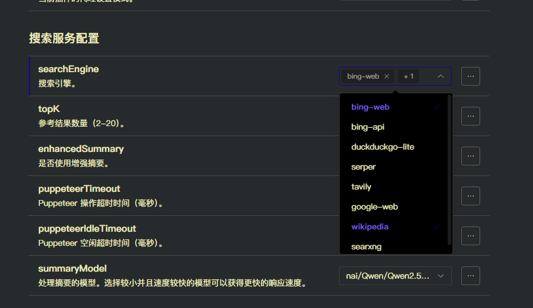
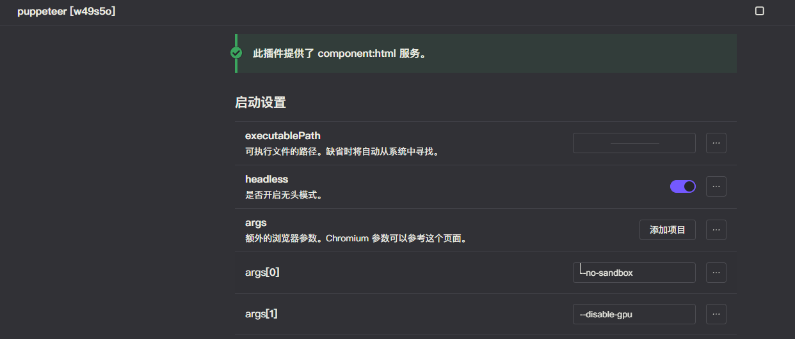

# 搜索服务 (Search Service)

此插件为 ChatLuna 提供多源的聚合搜索工具，并且基于 `Puppeteer` 提供网页浏览能力工具。

## 配置

* 前往插件市场，安装 `puppeteer` 插件。（大部分情况下 Koishi 已经安装了此插件，直接启用就好）
* 前往插件市场搜索 `chatluna-search-service` 并安装。


完成后则可以进行搜索引擎配置。

### 搜索引擎配置

打开 `chatluna-search-service` 插件的配置页面。可以看到我们能选择多种搜索引擎进行多源聚合搜索。



但大部分搜索引擎都需要额外的配置相关参数，才能正常使用。

#### bing-web、google-web、duckduckgo-lite

只需确认 `puppeteer` 插件启用，并且你的网络环境可以正常访问 Bing、Google 和 DuckDuckGo 即可。

#### serper

前往 [Serper](https://serper.dev/) 注册账号并获取 API Key。
填写相关参数到 [Serper 设置](#searxng-设置) 配置项中即可。

#### tavily

前往 [Tavily](https://app.tavily.com/home) 注册账号并获取 API Key。
填写相关参数到 [Tavily 设置](#tavily-设置) 配置项中即可。

#### bing-api

前往 [Bing](https://learn.microsoft.com/en-us/bing/search-apis/bing-web-search/overview) 获取 API Key。
填写相关参数到 [Bing API 设置](#bing-api-设置) 配置项中即可。

#### searxng

前往 [searxng](https://searx.space/) 获取可用的公共实例。
填写相关地址到 [searxng 设置](#searxng-设置) 配置项中即可。

#### wikipedia

你可以寻找支持 `mediawiki` 的维基网站，填入 API 地址到 [Wikipedia 设置](#wikipedia) 配置项中即可。

我们默认提供了 `https://en.wikipedia.org/w/api.php` 和 `https://mzh.moegirl.org.cn/api.php` 两个维基网站。

## 使用

配置完成后直接启用插件即可。此时已经可以正常使用 `browsing` 聊天模式和相关工具了。

> [!TIP] 提示
> 搜索服务在浏览网页时会使用 `Puppeteer` 进行网页浏览。
> 由于 `Puppeteer` 的一些奇妙问题，在使用时可能会出现异常的 CPU 占用。
> 我们建议对 `puppeteer` 插件进行配置：
>
> ```json
> [
>  "--no-sandbox",
>  "--disable-gpu"
> ]
> ```
>
> 
>
> 
>
> 将上面的 JSON 数组粘贴到 `puppeteer` 插件的配置项中即可。

## 配置项

此处列举了 `chatluna-search-service` 插件的配置项。

### 搜索服务配置

#### searchEngine

* 类型: `string[]`
* 默认值: `[]`

启用的搜索引擎列表。可选值包括： `bing-web` 、 `google-web` 、 `duckduckgo-lite` 、 `serper` 、 `tavily` 、 `bing-api` 、 `searxng` 、 `wikipedia` 。

此配置项支持多选，意味着你可以同时启用多个搜索引擎进行聚合搜索。

#### topK

* 类型: `number`
* 默认值: `5`
* 范围: `2-20`

参考结果数量。此值决定每次搜索返回的结果数量。
此值不要设置过大或者过小，都会影响到模型输出的质量。
我们推荐配置在 `3-6` 之间。

#### enhancedSummary

* 类型: `boolean`
* 默认值: `false`

是否启用增强摘要功能。启用后会对搜索结果的网页进行访问，以求获取更详细的内容。

#### puppeteerTimeout

* 类型: `number`
* 默认值: `60000`

Puppeteer 操作超时时间（毫秒）。

#### puppeteerIdleTimeout

* 类型: `number`
* 默认值: `300000`

Puppeteer 空闲超时时间（毫秒）。

#### summaryModel

* 类型: `string`
* 默认值: ``

处理搜索结果的模型。在启用了增强摘要功能后，会使用此模型总结和分析搜索获取的内容。

#### summaryType

* 类型：`speed` | `balanced` | `quality`
* 默认值：`balanced`

搜索结果摘要的生成策略，提供几种模式:

* `speed`: 优先考虑生成速度，直接返回搜索结果。
* `balanced`: 阅读网页，切块返回，提供一定的质量。
* `quality`: 使用 LLM 阅读和总结网页，高质量的结果。

> [!WARNING] 警告
> 对于 `balanced` 和 `quality` 模式，还需要额外配置主插件的 [`defaultEmbeddings`](../../guide/useful-configurations.md#defaultembeddings) 项，用于内容的向量化生成。

#### keywordExtractModel

* 类型: `string`
* 默认值: `gpt-3.5-turbo`

提取搜索结果关键词的模型。

#### multiSourceMode

* 类型: `average` | `total`
* 默认值: `total`

多源搜索结果的聚合策略，提供两种模式:

* `average`: 对每个搜索取前 total / K 个结果，聚合后对每个结果进行相似度检测，返回最高的 K 个结果。
* `total`: 对每个搜索源取前 K 个结果，聚合后对每个结果进行相似度检测，返回最高的 K 个结果。

#### searchThreshold

* 类型: `number`
* 默认值: `0.25`

搜索结果的相似度阈值。使用向量相似度检测，过滤掉相似度低于此阈值的结果。

### Serper 设置

#### serperApiKey

* 类型: `string`
* 默认值: ``

Serper API 密钥。

#### serperCountry

* 类型: `string`
* 默认值: `cn`

Serper 搜索地区。

#### serperLocation

* 类型: `string`
* 默认值: `zh-cn`

Serper 搜索语言。

#### serperSearchResults

* 类型: `number`
* 默认值: `10`

Serper 搜索结果数量。

### Bing API 设置

#### bingSearchApiKey

* 类型: `string`
* 默认值: ``

Bing API 密钥。

#### bingSearchLocation

* 类型: `string`
* 默认值: `zh-CN`

Bing API 搜索地区。

#### azureLocation

* 类型: `string`
* 默认值: `global`

Azure API 服务地区。

### Tavily 设置

#### tavilyApiKey

* 类型: `string`
* 默认值: ``

Tavily API 密钥。

### Wikipedia 设置

#### wikipediaBaseURL

* 类型: `string[]`
* 默认值: `["https://en.wikipedia.org/w/api.php", "https://mzh.moegirl.org.cn/api.php"]`

Wikipedia API 基础 URL。可以添加多个维基网站的 API 地址。

#### maxWikipediaDocContentLength

* 类型: `number`
* 默认值: `5000`

Wikipedia 文档内容的最大长度。超出此长度的内容会被截断。

### SearxNG 设置

#### searxngBaseURL

* 类型: `string`
* 默认值: `https://paulgo.io`

SearxNG API 基础 URL。可以填写任意可用的 SearxNG 实例地址。

### 进阶设置

> [! WARNING] 提示
> 如果你对 Prompt 工程不够熟悉，不要随意修改以下配置。否则会直接影响模型生成的质量。

#### searchPrompt

* 类型: `string`
* 默认值: `....`

搜索任务的 Prompt。用于模型理解搜索任务，并基于搜索结果生成符合人类偏好的回答。

#### newQuestionPrompt

* 类型: `string`
* 默认值: `....`

新问题 Prompt。用于模型理解用户的输入，并基于当前上下文生成新的回答。
