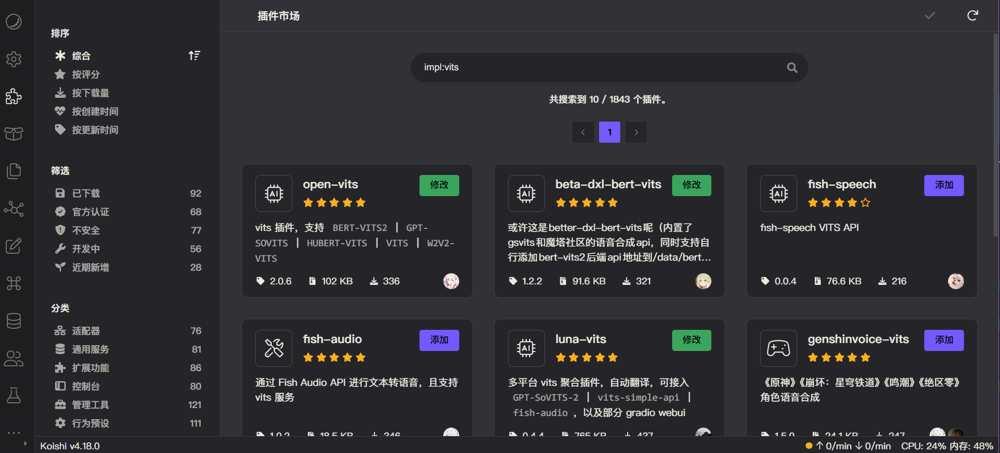

# 渲染输出

ChatLuna 针对模型的输出提供了一套渲染 API，可以方便的将模型输出渲染为不同的格式。

目前 ChatLuna 内置了以下几种输出：

- **raw**: 纯文本输出。将模型的回复内容直接输出。
- **text**: 基于 [koishi-plugin-markdown](https://markdown.koishi.chat/)，将模型的（Markdown）回复内容渲染为 Koishi 消息格式，输出到聊天平台上。
- **voice**: 基于 [vits](https://github.com/initialencounter/2022-12-24/blob/neat/plugins/Tool/vits/readme.md) 服务，将模型的回复内容转换成语音输出。
- **mixed-voice**: 基于 [vits](https://github.com/initialencounter/2022-12-24/blob/neat/plugins/Tool/vits/readme.md) 服务，将模型的回复内容转换成语音输出，同时也回复纯文本。

并且 ChatLuna 官方还维护 [`图片渲染器`](../../ecosystem/renderer/image.md)，支持以下几种输出：

- **image**: 使用 `Puppeteer` 将模型的回复内容渲染为图片输出。
- **mixed-image**: 使用 `Puppeteer` 将模型的回复内容渲染为图片输出，但是智能分段渲染。如列表，代码等发送纯图片，其他在通用聊天平台上支持的元素会以纯文本形式发送。

## 配置

前面内置的格式，除了语音输出，其他都无需配置。

## 语音输出

对于语音输出，你需要前往 Koishi 插件市场，安装并配置实现了 `vits` 服务的插件。

::tip 提示
可以使用 `impl:vits` 来搜寻实现了 `vits` 服务的插件。
::

具体配置请自行参考插件本身的主页，帮助等。

## 图片输出

请参考 [`图片渲染器`](../../ecosystem/renderer/image.md)。

## 使用

使用渲染输出分为两种场景。

### 单次设置

使用 [`chatluna.chat.text -t <mode>`](../useful-commands.md#直接对话) 命令进行聊天，`-t` 后面配上你的模式即可。

::tip 提示
使用 at 的响应无法进行单次设置输出模式。
::

### 全局设置（推荐）

前往 Koishi 控制台，找到 ChatLuna 主插件的配置项，在 [`outputMode`](../useful-configurations.md#outputmode) 选项里选择你需要使用的输出模式即可。

这是全局的设置，也包括艾特的响应。
