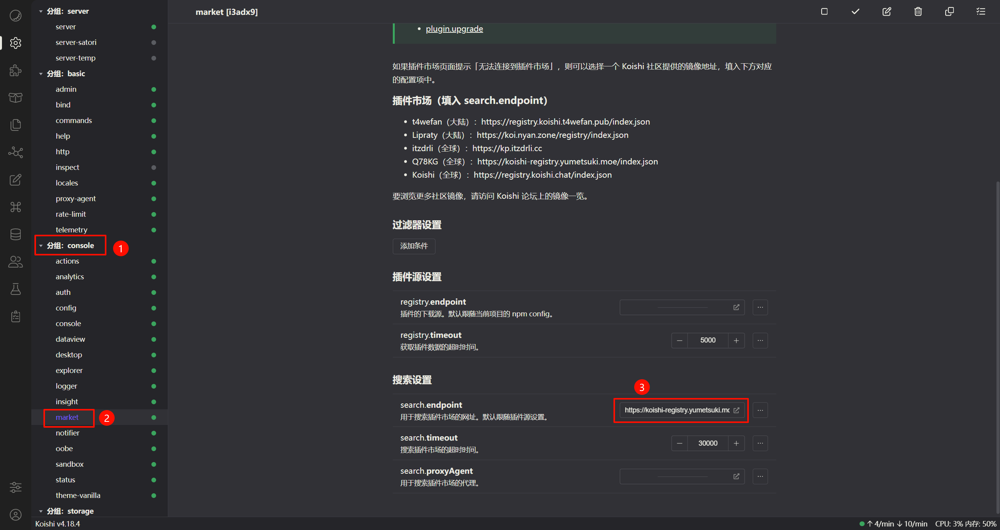
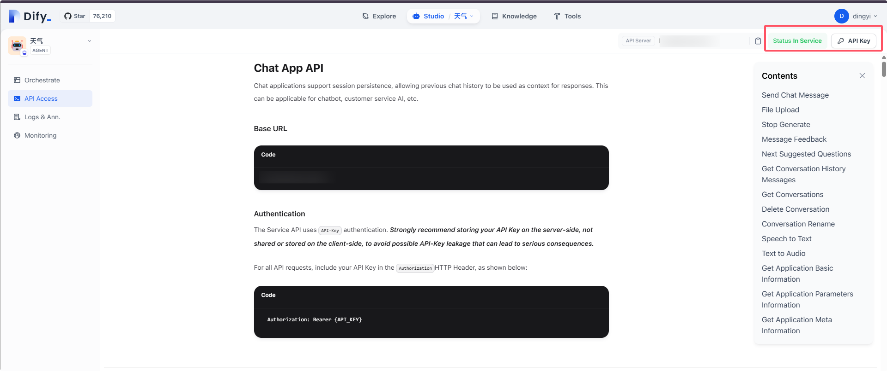
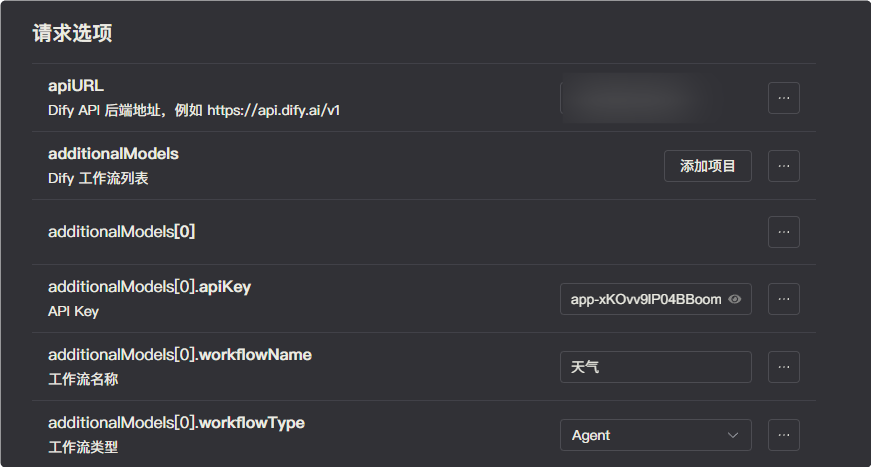

# Dify

Dify 是一款开源的大语言模型（LLM）应用开发平台，旨在通过声明式、低代码的方式简化生成式 AI 应用的构建与部署流程。其核心理念在于提供模块化设计、丰富的功能组件（如 AI 工作流、RAG 管道、Agent 框架等）以及对多种大语言模型（如 GPT、Llama3 等）的全面支持，使开发者能够通过简洁的 YAML 文件或可视化界面快速定义应用的 Prompt、上下文和插件等元素
。Dify 强调后端即服务（Backend as Service）和 LLMOps（大型语言模型运维）理念，提供单一 API 或开箱即用的 WebApp，支持从原型到生产的全生命周期管理，同时具备可观测性功能以监控日志和性能，便于持续优化

我们提供了 `dify-adapter` 适配器来接入 Dify 应用。

## 提示

Dify 的 API 更接近于 LLM 应用层的 API，而不是类似 OpenAI 等平台的 API，且 Dify 自维护了对话上下文。由于 ChatLuna 本身就维护了自己的对话上下文，这和 Dify 自维护的对话上下文冲突。所以 ChatLuna 的 Dify 适配器无法兼容现有的 ChatLuna 生态。

包括**ChatLuna 的预设系统**，**长期记忆**，**搜索服务**，**知识库**等都不支持。请自行使用 Dify 工作流实现上面的功能。

ChatLuna 最终选择以兼容的方式来接入 Dify 应用。当用户使用 ChatLuna 时，ChatLuna 会根据不同的房间，创建不同的 Dify 对话 ID，通过 Dify 自带的对话 ID 来管理对话。

可以理解为：一个 ChatLuna 房间对应一个 Dify 对话 ID。

但 ChatLuna 在运行 Dify 工作流时也会传入一些变量，包括用户的历史聊天内容，当前的用户名等，这使得你可以自定义更多的工作流内容，在下文我们会介绍。

建议在使用 Dify 适配器时，搭建的工作流尽量使用 Dify 的功能。将 ChatLuna 视为一个只传递了输入内容和一些变量给 Dify 的工具即可。

## 安装

前往插件市场，搜索 `chatluna-dify-adapter` ，安装即可。

::: tip 提示
如果无法正常搜索到 `chatluna-dify-adapter` ，则说明官方插件源没有正常更新。
前往 market 插件设置为其他源即可：

以下是推荐的一些插件源：

* [https://koishi-registry.yumetsuki.moe/index.json](https://koishi-registry.yumetsuki.moe/index.json)
* [https://kp.itzdrli.cc]([https://kp.itzdrli.cc)

:::

## 配置

前往你个人部署（或云的）Dify 页面，选择你需要接入的应用。

进入应用的配置页面，点击右上角的 API Key：

复制 API Key 到适配器的配置页面。

添加相关的 API Key，并填写应用的名称，选择应用的类型：

你也可以接入多个应用，点击添加项目，基于上面的步骤添加即可。

完成后记得点击右上角的保存按钮。

## 使用

在适配器的配置页面，点击运行按钮，如无误，你应该看不到任何错误 log，那即可转到 ChatLuna 的主插件页面。

在主插件页面，下划到 [模版房间选项](../useful-configurations.md#模版房间选项)，查看 [defaultModel](../useful-configurations.md#defaultmodel) 的选项里是否含有 Dify 模型，如果有，则说明你已经成功地接入了 Dify 平台。

## 可用变量

ChatLuna 会将以下变量传入 Dify 工作流中：

* `chatluna_history`：当前对话的聊天内容，为 string 格式的 JSON 数组。包含了 role 和 content 两个字段。
* `chatluna_user_name`：当前对话的用户名。
* `chatluna_user_id`：当前对话的用户 ID。
* `chatluna_conversation_id`：当前对话的 ChatLuna 对话 ID
* `input`：用户输入的内容。

你可以在 Dify 工作流中使用这些变量，来自定义你的工作流。
