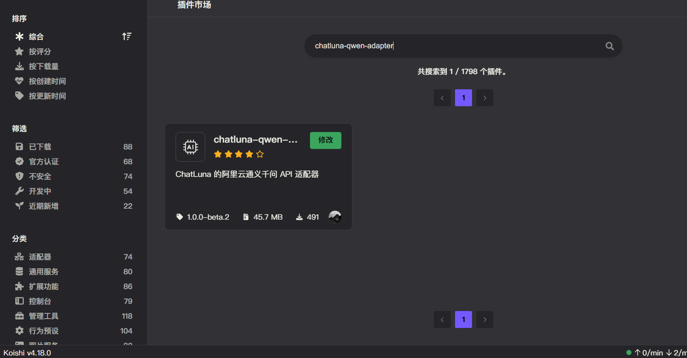
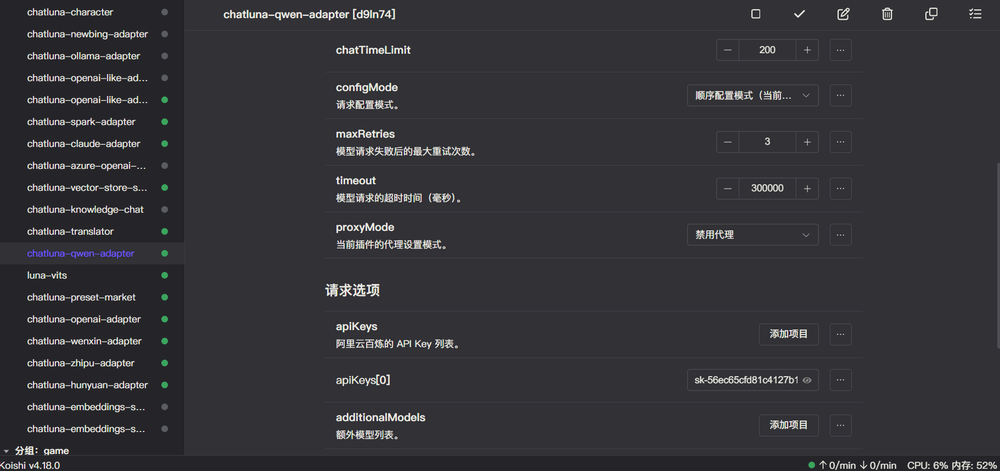
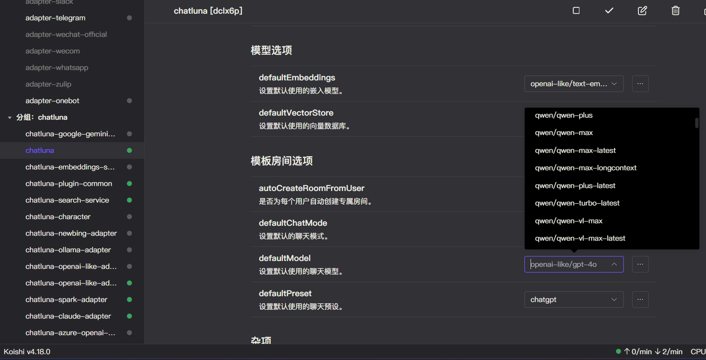

# 通义千问

通义千问，是由阿里云推出的大语言模型，旗下同时开放 `qwen-turbo`,`qwen-plus` 等模型。

我们支持对接通义千问里大部分可用的聊天大语言模型或嵌入模型。

由于 API 限制，我们无法获取到通义千问的最新模型列表，所以当通义千问发布新模型时，我们滞后一段时间才会更新模型列表。

## 安装

前往插件市场，搜索 `chatluna-qwen-adapter`，安装即可。

## 配置

在配置之前，请先参考 [首次调用通义千问 API](https://help.aliyun.com/zh/model-studio/getting-started/first-api-call-to-qwen?spm=5176.12818093_-1363046575.console-base_help.dexternal.3bd416d0aMZwE0#f92b9b9cc7huw) 开通 API 服务。并前往[控制台](https://bailian.console.aliyun.com/?spm=a2c4g.11186623.0.0.6a822562V5KcWo&apiKey=1#/api-key)获取 API key。

::: tip 提示
未来我们可能会录制官方教程，敬请期待。
:::

获取到 API key 后，转到 `qwen-adapter` 的配置页面。

默认插件有一个空的适配项，填入你的 API key 即可。

记得点击右上角的保存按钮。

## 使用

在千问适配器的配置页面，点击运行按钮，如无误，你应该看不到任何错误 log，那即可转到 ChatLuna 的主插件页面。

在主插件页面，下划到 [模版房间选项](../useful-configurations.md#模版房间选项)，查看 [defaultModel](../useful-configurations.md#defaultmodel) 的选项里是否含有 qwen 模型，如果有，则说明 qwen 适配器已经成功的运行。

但我们仍未完全确认千问适配器是否连接到你设置了的平台。

因此我们需要新建一个房间，使用 `chatluna.room.create -m qwen/qwen-turbo -p chatgpt -n test-qwen-adapter` 指令来创建一个使用了 qwen 适配器的房间。

新建房间后请尝试和模型对话。

只要能正常对话，就说明你成功的连接到了阿里云的通义千问 API。

别忘了在测试完成后调用 `chatluna.room.delete test-qwen-adapter` 指令删除测试房间。
