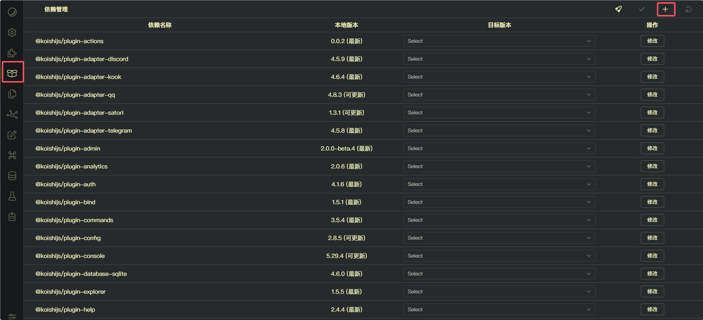
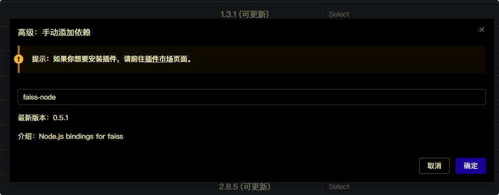

# Faiss

Faiss 是一个由 Meta 的基础人工智能研究小组开发，用于高效相似性搜索和稠密向量聚类的库。它包含可以在任何大小的向量集合中进行搜索的算法，甚至可以处理可能无法完全放入 RAM 的数据集。该库还包含用于评估和参数调优的辅助代码。Faiss 使用 C++ 编写，并为 Python/numpy 提供了完整的封装。

## 安装

前往插件市场，搜索并安装 `chatluna-vector-store-service` 即可。

注意 Faiss 数据库的依赖 `faiss-node` 被标记为该插件的可选依赖，你需要在启用前安装 `faiss-node`。

在 Koishi 控制面板的 `依赖管理` 中，安装 `faiss-node`。

>[!TIP] 重要提示
>
> 如你在 windows 环境下使用 Koishi，在安装 `faiss-node` 前，请确保你的系统安装了 `git`, `npm`, 并配置好 `node-gyp`。
>
> 还需要你的网络环境可以流畅访问 github。

## 使用

1. 安装 `chatluna-vector-store-service`，并确保安装 `faiss-node`，确认安装成功后，启用该插件。
2. 在向量适配器中选中 faiss。

   

3. 在主插件的 [模型选项](../useful-configurations.md#模型选项) 中找到 [defaultVectorStore](../useful-configurations.md#defaultvectorstore) 配置项，选择为 `faiss` 即可。
