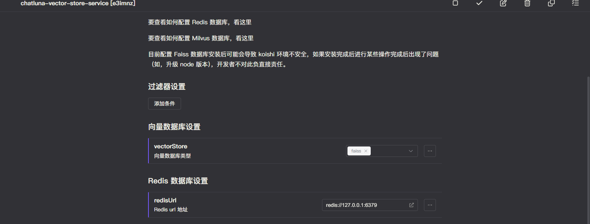

# Redis

Redis 是一个高性能的键值对数据库，广泛用于缓存、会话存储、消息队列等场景。
Redis 同时支持安装扩展模块，可以通过安装 `Redisearch` 模块来支持向量数据库功能。

## 安装

在使用之前，需要先确保你的 Redis 实例支持 Redisearch 模块。

有几种方式可以安装或使用带有 Redisearch 模块的 Redis 实例：

- 安装 Redis Stack，这是 Redis 的扩展版本，集成了多个模块，包括了 Redisearch 模块。参考 [安装 Redis Stack](https://redis.io/docs/latest/operate/oss_and_stack/install/install-stack/)。
- 使用 Redis Cloud，参考 [Redis Cloud 使用](https://redis.io/docs/latest/operate/rc/)。
- 为全新 Redis 或者已有的 Redis 实例安装 Redisearch 模块（非 Docker 环境，Docker 环境建议使用 Redis Stack），参考[Redisearch 安装](https://help.onehash.ai/en/article/installing-redisearch-to-enable-super-fast-e-commerce-search-w63yyg/) 和 [Stackoverflow](https://stackoverflow.com/questions/78580457/how-to-compile-redissearch-module-from-source)。

确保你的 Redis 实例支持 Redisearch 模块后，就可以在 `vector-database-service` 中配置 Redis 连接地址了。

将 Redis Stack 的连接地址填入 `vector-database-service` 中的 `redisUrl` 中即可。

## 使用

1. 安装 `chatluna-vector-store-service`，启用该插件。
2. 在向量适配器中选中 redis。

   

3. 在主插件的 [模型选项](../useful-configurations.md#模型选项) 中找到 [defaultVectorStore](../useful-configurations.md#defaultvectorstore) 配置项，选择为 `redis` 即可。
