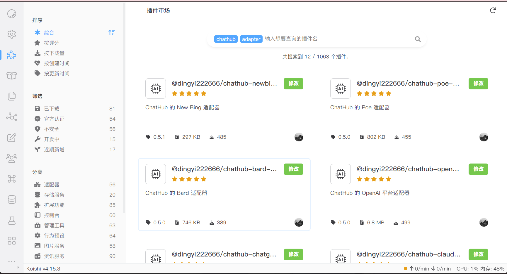

# 快速上手

本节，我们将指导你如何安装与配置 ChatLuna，让你能快速的和模型进行对话。

## 安装 Koishi

在使用 ChatLuna 之前，你需要安装 Koishi。

按照 [Koishi 官方文档](https://koishi.chat/zh-CN/) 来安装 Koishi。

## 配置聊天平台

安装 Koishi 后，你需要选择一个聊天平台来接入机器人，或使用 [沙盒环境](https://koishi.chat/zh-CN/manual/console/sandbox.html) 测试。

如你选择使用沙盒环境，可以直接跳到 [下一步](/guide/getting-started.html#安装前置依赖插件)。

如你选择接入实际的聊天平台，请参考 [接入真实聊天平台](https://koishi.chat/zh-CN/manual/usage/adapter.html#%E6%8E%A5%E5%85%A5%E7%9C%9F%E5%AE%9E%E8%81%8A%E5%A4%A9%E5%B9%B3%E5%8F%B0)。

## 安装前置依赖服务

安装 ChatLuna 的必要前置依赖服务，ChatLuna 需要这些服务来提供基础功能。

### 数据库服务

ChatLuna 需要 `database` 服务，用于存储会话信息等持久化数据。

我们推荐使用 `database-sqlite`，它自带在大部分 Koishi 环境里，已被默认安装并启用。

你也可以安装并配置其他在 Koishi 插件市场上的数据库插件，如 MySQL、MongoDB 等。

### 可选服务

这些服务是为了 ChatLuna 的某些功能而额外需要的服务。你可以根据需要选择安装。

- `censor` 服务：用于回复内容过滤。注意，有的插件不审核文本信息，请注意识别。
- `vits` 服务：用于渲染模型回复，生成语音。

## 安装主插件

搜索并安装 `chatluna` 插件，这是 ChatLuna 的主插件。

::: warning 注意
主插件本身不包含任何模型适配器，无法直接对话，还需安装模型适配器。
:::

## 安装模型适配器

安装你需要平台的模型适配器。在插件市场输入 `ChatLuna + <adapter>` 搜索并选择你需要的适配器安装。

你可同时安装多个平台的模型适配器，后续可通过模版房间配置或房间里的模型配置项切换。

## 配置主插件

进入主插件配置页面，以下是一些重要的配置项，其他配置项可在 [配置项](/guide/useful-configurations) 了解到：

- [`isProxy`](/guide/useful-configurations#代理设置)：是否使用代理，对国内用户**强烈推荐**开启。
- [`proxyAddress`](/guide/useful-configurations#代理设置)：代理地址，格式为 `http://host:port`。
- [`outputMode`](/guide/useful-configurations#回复选项)：回复的输出格式，支持语音、文本、图片等。

## 配置模型适配器

参考 [模型平台](./configure-model-platform/introduction.md)，选择你需要配置的模型平台类型。

::: warning 注意
如果你所在的地区无法访问某些模型 API 服务，则可能需要设置代理。请在 `ChatLuna` 主插件的设置里设置代理(请求设置 -> [`isProxy`](./useful-configurations#isproxy)，请求设置 -> [`proxyAddress`](./useful-configurations#proxyaddress))。
:::

可使用 [`chatluna.model.list`](./useful-commands.md#列出语言模型列表) 查看可用的模型。

## 使用群友的反代加速API

**此为 社区作品 可能会遇到一些问题，欢迎反馈。**

**openai : openai.chatluna.us.kg**

**gemini : gemini.chatluna.us.kg**

**claude : claude.chatluna.us.kg**

你需要替换官方的API地址，如api.openai替换为openai.chatluna.us.kg,以此类推

(docs/public/images/plugin_openai_adapter_proxy_API.png)

(docs/public/images/plugin_gemini_adapter_proxy_API.png)

(docs/public/images/plugin_claude_adapter_proxy_API.png)

## 设置模版房间配置

在控制面板里可设置模版房间的相关配置，如图所示：

设置好模型，聊天模式和预设，右上角保存后即完成配置。

::: tip 提示
对于初次使用 ChatLuna 的新手，我们推荐直接使用模型克隆房间。当你对 ChatLuna 有深入了解后，才推荐使用自定义的房间系统。
:::

## 开始聊天

最后使用 [`chatluna.chat.text`](/guide/useful-commands#模型对话) 命令，即可和模型进行交互对话。

通过以上步骤，你已经基本配置好了 ChatLuna，并且可以和模型对话了。

接下来你可以在下面的章节学习到更多的配置和使用方法。
