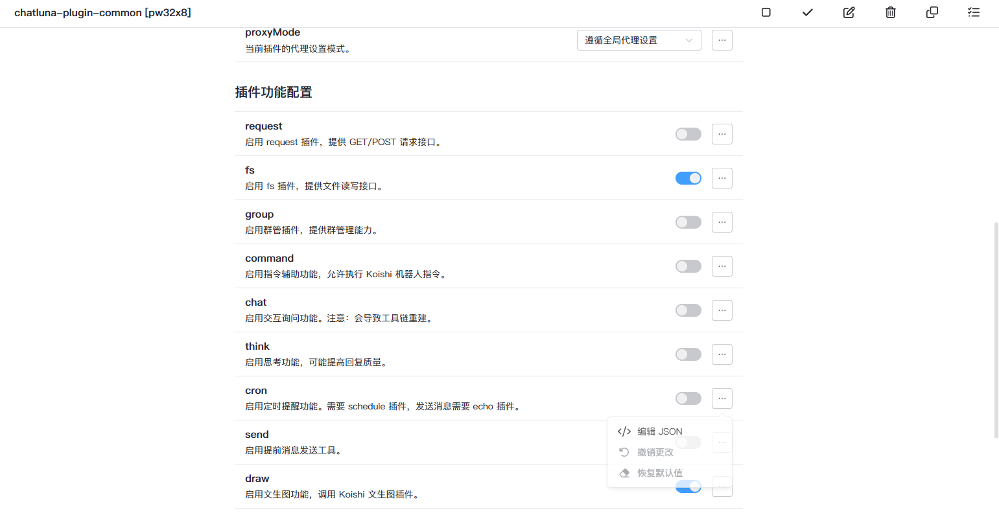
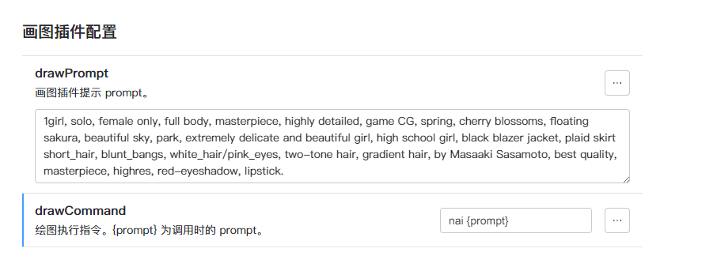

# 文生图

文生图工具与 `command` 工具类似，都是通过调用 koishi 上的命令来实现相关功能。

## 配置

- 确保你的 Koishi 已经安装了支持文生图的插件。(推荐使用 [novelai-bot](https://github.com/koishijs/novelai-bot))
- 参考 [介绍](introduction.md) 中的配置方法，启用 `plugin-common` 插件。
- 按照下图在 `plugin-common` 插件中启用 `draw` 选项。

向下滑动，找到 `画图插件配置` 选项，你需要在这里设置调用文生图插件的命令。

- 在 `drawCommand` 中，`{prompt}` 即为调用命令是的提示词，`{image}` 即为生成的图片。

  对于 `novelai-bot` 插件，默认即为 `nai {prompt}`。其他的文生图插件需要你自行设置。

- `drawPrompt` 即为给模型参考的提示词，你可以设置为其他更高质量的 prompt 来辅助模型生成。

## 测试

将当前房间设置为插件模式，即可询问模型进行文生图。当机器人发送的内容包含图片时，说明文生图工具配置成功。

<chat-panel>
  <chat-message nickname="User">chatluna.chat.text 画一个在樱花树下的和服少女</chat-message>
  <chat-message nickname="Bot">
   { 
    &nbsp;&nbsp;tool: 'draw', 
    &nbsp;&nbsp;arg: '{"input":"1girl, solo, female only, full body, masterpiece, highly detailed, cherry blossoms, sakura tree, beautiful sky, park, extremely delicate and beautiful girl, wearing kimono, high quality, masterpiece, highres"}' 
  }
  </chat-message>
  <chat-message nickname="Bot"></chat-message>
  <chat-message nickname="Bot">The artwork of a beautiful girl in a kimono under the cherry blossom tree has been created! Enjoy the serene and picturesque scene.</chat-message>
</chat-panel>
