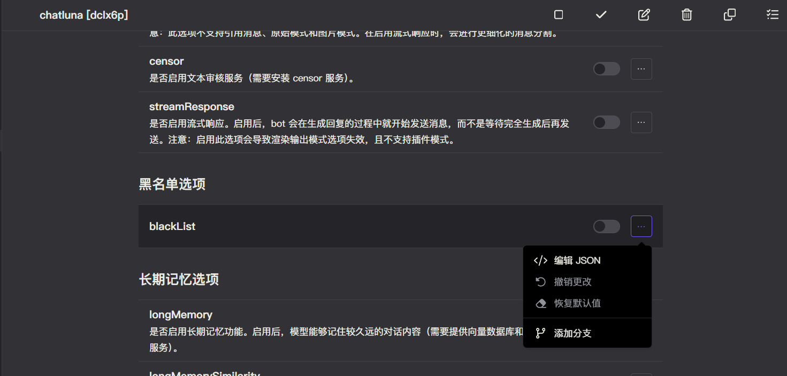
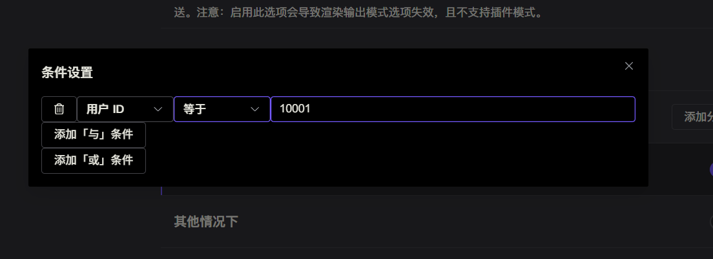
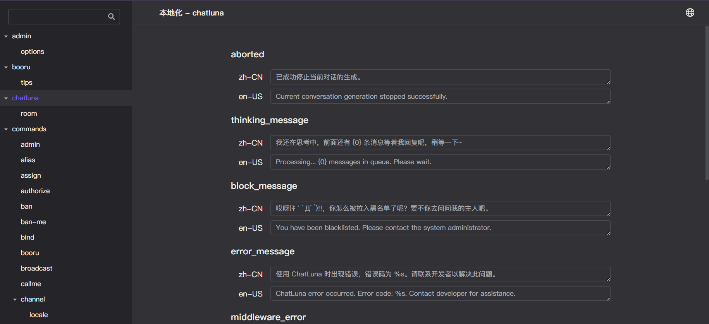

# 黑名单

ChatLuna 基于 Koishi 的 [条件属性](https://koishi.chat/zh-CN/manual/usage/customize.html#%E6%9D%A1%E4%BB%B6%E5%B1%9E%E6%80%A7) 提供黑名单功能。

基于 Koishi 的条件属性有几大好处：

1. 可以精确指定不同账号的拉黑，或者大致指定某个群，甚至是某个平台拉黑。
2. 实际值存储在 Koishi 配置文件中，无需从数据库读取，加快速度。
3. Koishi 自带的 WebUI 能以可视化形式编辑这些列表，无需接触配置文件。

下面就来了解下怎么配置吧。

## 配置

默认情况下黑名单列表应该是空的，我们可以点击右边的三点触发菜单，点击 「添加分支」菜单即可新建一个黑名单属性。

点击「当满足条件」右边的无，即可编辑这个条件属性。

我们可以编辑各类条件，详细参考 [Koishi 文档](https://koishi.chat/zh-CN/manual/usage/customize.html#%E6%9D%A1%E4%BB%B6%E5%B1%9E%E6%80%A7)。这里我们设置了条件为用户 ID 等于某值。

设置完成后，把属性右边的开关打开，即代表启用了该属性。

只要属性右边的开关为开，则代表启用这个属性。当属性的条件被触发时，则会返回拉黑文本。

<chat-panel>
  <chat-message nickname="10001">chatluna.chat.text Hello</chat-message>
  <chat-message nickname="Bot">哎呀(ｷ｀ﾟДﾟ´)!!，你怎么被拉入黑名单了呢？要不你去问问我的主人吧。</chat-message>
 </chat-panel>

## 本地化

ChatLuna 默认提供了中英两种语言的支持。当然你也可以在 Koishi WebUI 的本地化中修改相关拉黑文本。

我们可以修改成 「闭嘴吧你」，然后重新试试触发拉黑文本。

<chat-panel>
  <chat-message nickname="10001">chatluna.chat.text Hello</chat-message>
  <chat-message nickname="Bot">闭嘴吧你</chat-message>
 </chat-panel>

 这时候就会返回修改后了的拉黑文本。
